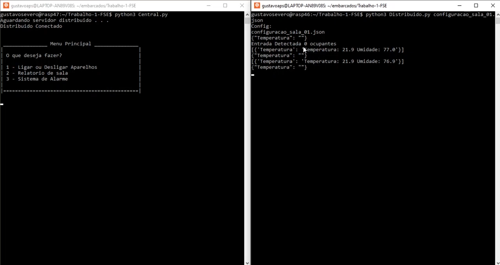
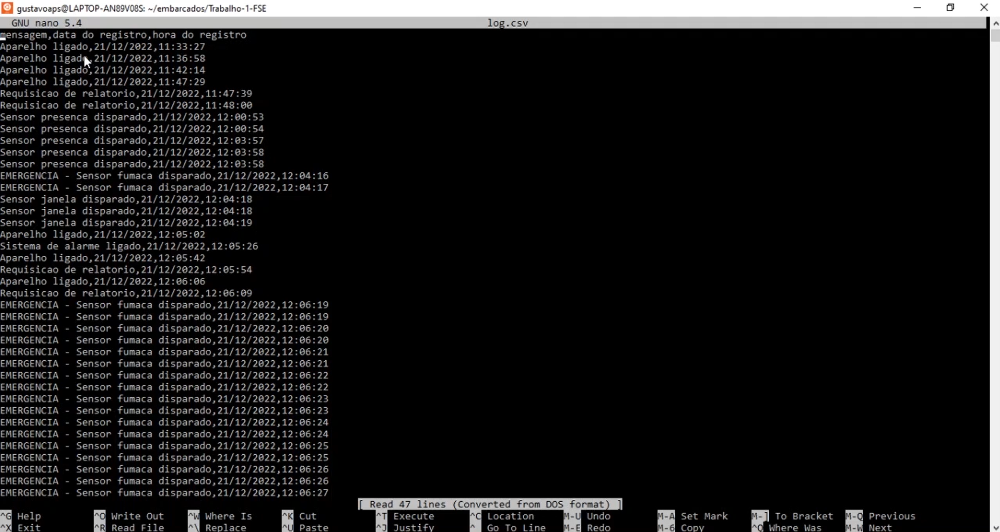

# Projeto 1 - FSE

## Introdução

Este trabalho tem por objetivo a criação de um sistema distribuído de automação predial para monitoramento e acionamento de sensores e dispositivos de um prédio com múltiplas salas. O sistema deve ser desenvolvido para funcionar em um conjunto de placas Raspberry Pi com um servidor central responsável pelo controle e interface com o usuário e servidores distribuídos para leitura e acionamento dos dispositivos. Dentre os dispositivos envolvidos estão o monitoramento de temperatura e umidade, sensores de presença, sensores de fumaça, sensores de contagem de pessoas, sensores de abertura e fechamento de portas e janelas, acionamento de lâmpadas, aparelhos de ar-condicionado, alarme e aspersores de água em caso de incêndio.

## Dados do Aluno

| Nome                          | Matrícula  |
| ----------------------------- | ---------- |
| Gustavo Afonso Pires Severo   | 17/0034992 |


## Link da Apresentação

[](https://youtu.be/4v6FVHhwNKY)

## Dependências

pip3 install adafruit-blinka
pip3 install adafruit-circuitpython-dht


## Como Executar

Ao realizar o clone deste repositório em ambas placas Raspberry Pi, em cada um dos terminais, digite os comandos:

### Terminal 1 - Servidor Central

```bash
$ python3 Central.py
```

### Terminal 2 - Servidor Distribuído

```bash
$ cd python3 Distribuido.py configuracao_sala_01.json
-Ou o outro arquivo de config a depender da placa
```

**_OBS: Executar primeiro o servidor central e, em seguida, executar o servidor distribuído._**
**_O Ip do servidor tem que ser settado manualmente para a placa rodando o servidor_**

## Relatório - Dispositivos de Saída

O log dos comandos acionados dos dispositivos de saída se encontra no arquivo `log.csv` criado durante a execução.

### Apresentação do Sistema




## Referências

[gpiozero](https://gpiozero.readthedocs.io/en/stable/)
